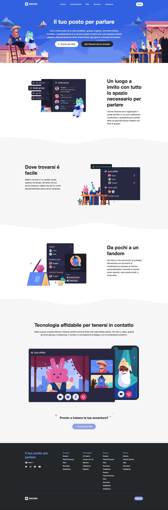

## Discord - Replica web-page

**Initial commit**: 07/02/23

**Tecnologie:** HTML e CSS.

🔊 In questo esercizio realizzato per Boolean, prima abbiamo progettato il layout-html tramite Penpot e l'ausilio di blocchi colorati, dopodiche mi sono concentrato a standardizzare il più possibile le classi usando i selettori avanzati in modo da avere un codice leggibile, chiaro e mantenibile.

